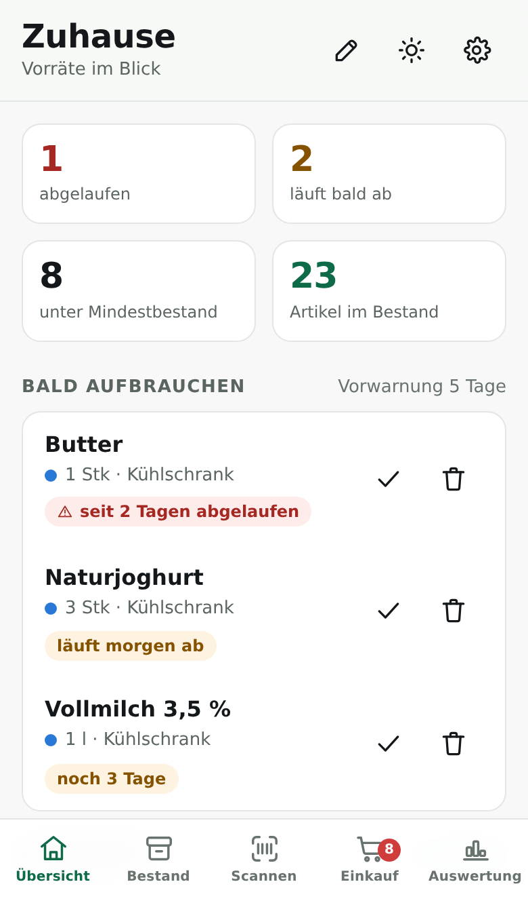
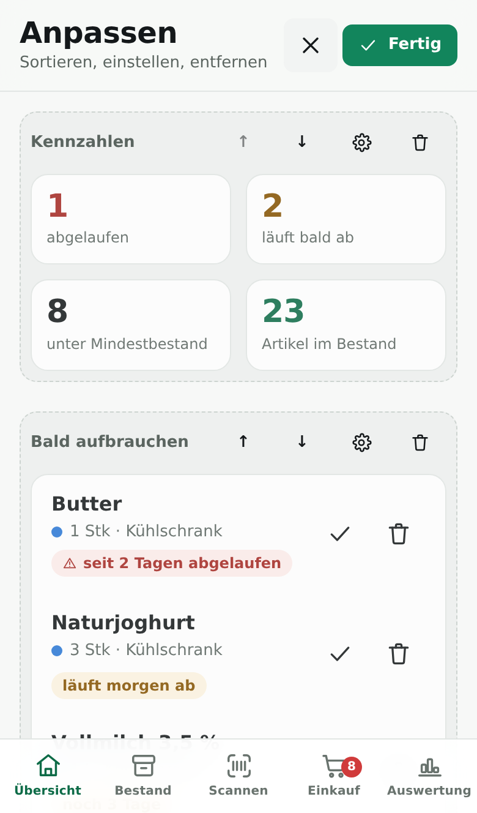
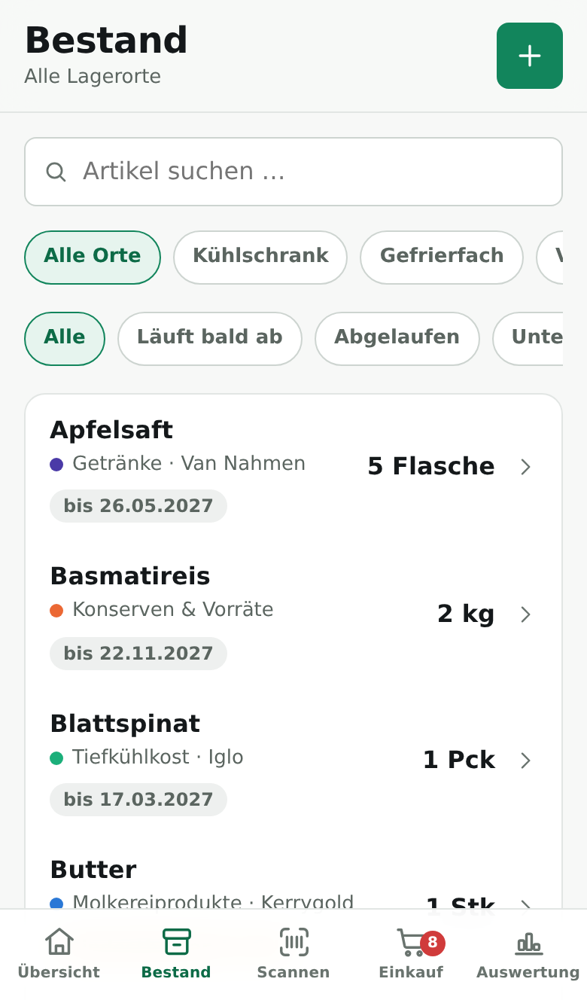
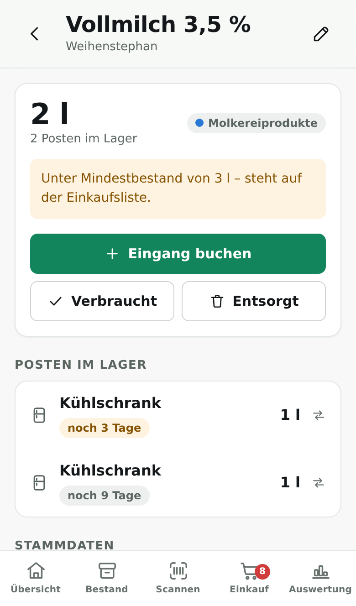
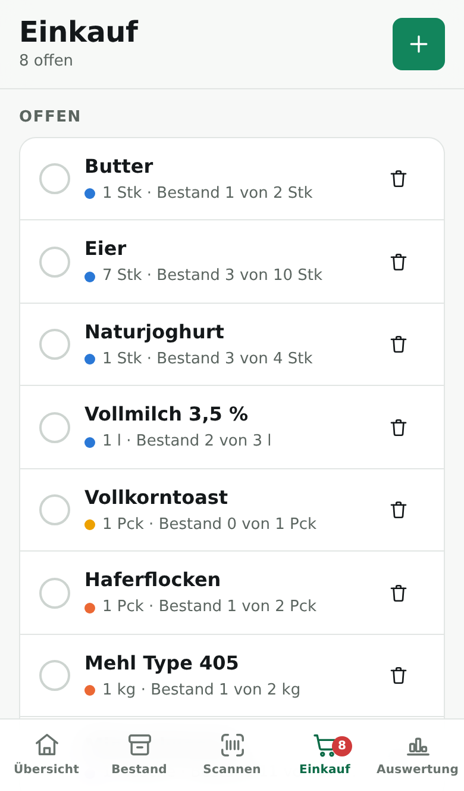
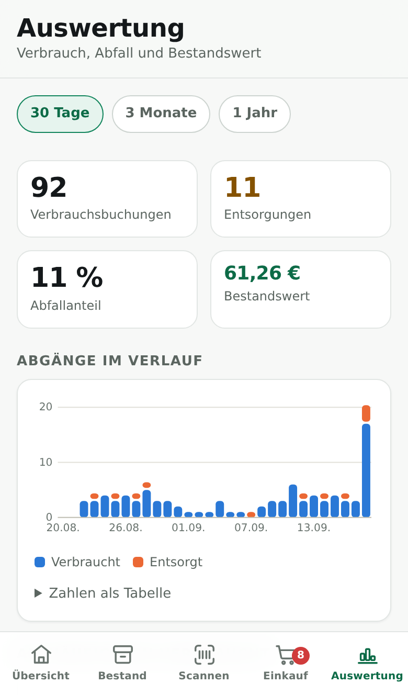
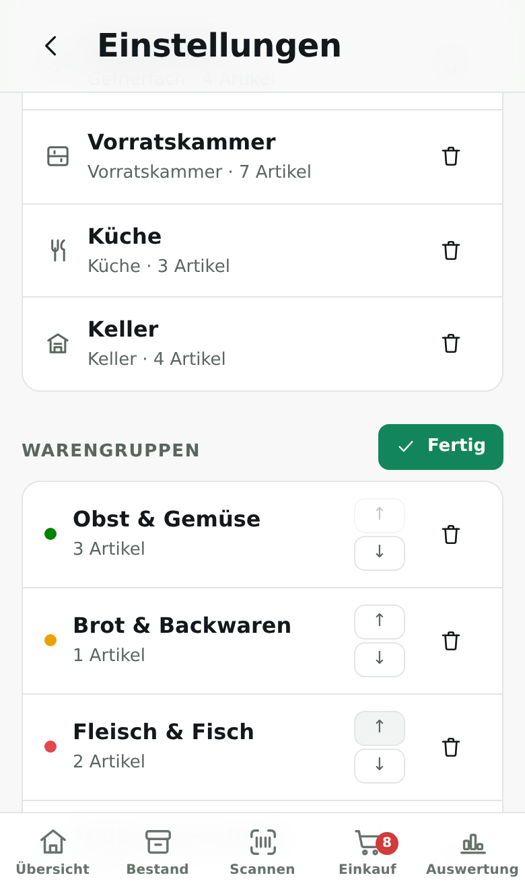

# Warensystem Home

Eine Warenwirtschaft für den eigenen Haushalt: Lebensmittel erfassen, Bestände
je Lagerort führen, Mindesthaltbarkeitsdaten im Blick behalten und sehen, was
tatsächlich verbraucht und was weggeworfen wird.

Die App läuft als kleiner Server bei dir zuhause. Alle Geräte im Heimnetz –
iPhone, iPad, Laptop – greifen auf **denselben Bestand** zu. Keine Cloud, kein
Konto, keine laufenden Kosten. Auf dem iPhone lässt sie sich über
„Zum Home-Bildschirm“ wie eine normale App installieren.

| Übersicht | Anpassen | Bestand | Artikel | Einkauf | Auswertung |
|---|---|---|---|---|---|
|  |  |  |  |  |  |

## Was die App kann

**Übersicht nach eigenem Zuschnitt.** Die Startseite ist nicht fest verdrahtet:
Abschnitte lassen sich hinzufügen, sortieren, einstellen und wieder entfernen.
Zur Auswahl stehen Kennzahlen (mit frei wählbaren Kacheln), „Bald aufbrauchen“,
Lagerorte, Einkaufsliste, „Unter Mindestbestand“, letzte Buchungen, der Bestand
eines einzelnen Lagerorts und freie Notizen. Die Zusammenstellung liegt beim
Haushalt, nicht beim Gerät – sie sieht also auf iPhone und Laptop gleich aus.

**Lagerorte.** Kühlschrank, Gefrierfach, Vorratskammer, Küche und Keller sind
vorangelegt. Weitere Orte – Gefriertruhe im Keller, Getränkeregal, Speisekammer –
lassen sich jederzeit ergänzen und mit passendem Symbol versehen.

Lagerorte und Warengruppen lassen sich in die eigene Reihenfolge bringen – in
den Einstellungen über „Sortieren“ am jeweiligen Abschnitt. Die Pfeile
erscheinen nur in diesem Modus, damit die Listen sonst ruhig bleiben. Die
gewählte Folge gilt überall, wo die Listen auftauchen: in den Auswahlfeldern,
den Filtern auf der Bestandsseite und auf der Übersicht.



**Bestand nach Posten.** Ein Artikel kann gleichzeitig an mehreren Orten und mit
unterschiedlichen Haltbarkeitsdaten liegen. Zwei Packungen Milch mit
verschiedenem MHD sind zwei Posten – das ist der Unterschied zu einer bloßen
Zählliste.

**Haltbarkeit.** Die Übersicht zeigt, was abgelaufen ist und was in den nächsten
Tagen abläuft. Verbrauch wird automatisch nach FEFO gebucht: zuerst geht weg,
was zuerst schlecht wird, angebrochene Packungen zuerst.

**Barcode scannen.** Produkte über die Handykamera erfassen. Unbekannte Barcodes
schlägt der Server bei Open Food Facts nach und schlägt Name und Marke vor.
(Siehe [Barcode-Scanner auf dem iPhone](#barcode-scanner-auf-dem-iphone).)

**Einkaufsliste.** Wer einem Artikel einen Mindestbestand gibt, findet ihn
automatisch auf der Liste, sobald der Vorrat darunter fällt. Nach dem Einkauf
wandert alles Abgehakte mit einem Tippen zurück in den Bestand.

**Auswertung.** Verlauf von Verbrauch und Entsorgung, die am häufigsten
verbrauchten und weggeworfenen Artikel, Abfallanteil und erfasster Warenwert.

**Sicherung.** Der Server legt täglich eine Sicherung ab und behält die letzten
vierzehn. Zusätzlich lässt sich der gesamte Bestand jederzeit als JSON-Datei
herunterladen und wieder einspielen.

## Schnellstart

Vorausgesetzt wird **Node.js ab Version 22.5** ([nodejs.org](https://nodejs.org)).
Ein Raspberry Pi 4, ein NAS oder ein alter Laptop reicht völlig aus.

```bash
git clone https://github.com/Marlon1694/Warensystem-Home.git
cd Warensystem-Home

npm install       # Abhängigkeiten laden
npm run build     # Oberfläche bauen
npm start         # Server starten
```

Beim Start nennt der Server die Adressen, unter denen er erreichbar ist:

```
Warensystem Home läuft.
  Auf diesem Gerät:  http://localhost:4000
  Im Heimnetz:       http://192.168.1.42:4000
  Datenbank:         /home/pi/Warensystem-Home/data/warensystem.db
  Sicherungen:       /home/pi/Warensystem-Home/data/backups
```

Die Adresse unter „Im Heimnetz“ ist die, die du auf dem iPhone öffnest.

> **Tipp:** Damit sich diese Adresse nicht ändert, gib dem Rechner in deinem
> Router eine feste IP-Adresse (in der FRITZ!Box unter *Heimnetz → Netzwerk →
> Gerätedetails → „Immer die gleiche IPv4-Adresse zuweisen“*).

### Auf Proxmox als LXC-Container

Ein Skript legt einen unprivilegierten Container an und installiert alles
darin. Auf der **Shell des Proxmox-Hosts** ausführen, nicht in einem Container:

```bash
bash -c "$(curl -fsSL https://raw.githubusercontent.com/Marlon1694/Warensystem-Home/HEAD/deploy/proxmox-lxc.sh)"
```

Vorgabe sind 2 Kerne, 1 GB Arbeitsspeicher, 8 GB Platte und eine Adresse per
DHCP. Abweichungen über Umgebungsvariablen:

```bash
# Mehr Arbeitsspeicher, anderer Speicher für die Festplatte
RAM_MB=2048 ROOTFS_STORAGE=local-zfs \
  bash -c "$(curl -fsSL https://raw.githubusercontent.com/Marlon1694/Warensystem-Home/HEAD/deploy/proxmox-lxc.sh)"
```

#### Feste IP-Adresse

Damit die Adresse im Heimnetz gleich bleibt – sonst ändert sich das Lesezeichen
auf dem iPhone nach jedem Neustart:

```bash
IPV4=192.168.1.50/24 GATEWAY=192.168.1.1 \
  bash -c "$(curl -fsSL https://raw.githubusercontent.com/Marlon1694/Warensystem-Home/HEAD/deploy/proxmox-lxc.sh)"
```

Drei Dinge sind dabei wichtig:

- **Die Netzmaske hinter dem Schrägstrich gehört dazu** (`/24` bei einem
  üblichen Heimnetz). Ohne sie bricht das Skript mit einem Hinweis ab.
- **Gateway ist die Adresse des Routers** und muss im selben Netz liegen wie
  der Container. Bei einer FRITZ!Box üblicherweise `192.168.178.1`, dann wäre
  die Adresse des Containers z. B. `192.168.178.50/24`.
- **Die Adresse muss frei sein** und außerhalb des DHCP-Bereichs des Routers
  liegen, sonst vergibt der Router sie irgendwann ein zweites Mal. Das Skript
  prüft vorab per Ping, ob dort schon jemand antwortet.

Den DNS-Server liefert sonst der DHCP-Server mit. Bei fester Adresse übernimmt
der Container die Einstellungen des Proxmox-Hosts – das passt meistens. Wenn
nicht, lässt er sich mitgeben:

```bash
IPV4=192.168.178.50/24 GATEWAY=192.168.178.1 NAMESERVER=192.168.178.1 \
  bash -c "$(curl -fsSL https://raw.githubusercontent.com/Marlon1694/Warensystem-Home/HEAD/deploy/proxmox-lxc.sh)"
```

Alternativ bleibt die Adresse auch bei DHCP gleich, wenn du sie im Router fest
an den Container bindest (FRITZ!Box: *Heimnetz → Netzwerk → Gerätedetails →
„Diesem Netzwerkgerät immer die gleiche IPv4-Adresse zuweisen“*).

| Variable | Vorgabe | Bedeutung |
|---|---|---|
| `CTID` | nächste freie | Container-ID |
| `CT_HOSTNAME` | `warensystem` | Name des Containers |
| `CORES` / `RAM_MB` / `DISK_GB` | `2` / `1024` / `8` | Ausstattung |
| `IPV4` / `GATEWAY` | `dhcp` | Feste Adresse statt DHCP, z. B. `192.168.1.50/24` und `192.168.1.1` |
| `NAMESERVER` | Host-Einstellung | DNS-Server, meist die Adresse des Routers |
| `SEARCHDOMAIN` | Host-Einstellung | Suchdomäne, z. B. `fritz.box` |
| `BRIDGE` | `vmbr0` | Netzwerkbrücke |
| `ROOTFS_STORAGE` | `local-lvm` | Speicher für die Festplatte |
| `TEMPLATE_STORAGE` | `local` | Speicher für die Container-Vorlage |
| `PORT` | `4000` | Port der Anwendung |
| `ENABLE_TLS` | `yes` | Zertifikat gleich mit erzeugen |
| `FEATURES` | `nesting=1` | Zusatzfunktionen des Containers; `FEATURES=` schaltet sie ab |
| `SKIP_CREATE` | `0` | `1` bespielt einen bereits vorhandenen Container |

Danach:

```bash
pct exec <CTID> -- journalctl -u warensystem-home -f   # Protokoll ansehen
pct exec <CTID> -- bash /root/install.sh               # auf neuen Stand bringen
pct enter <CTID>                                       # Konsole im Container
```

#### Wenn der Container nicht startet

Bleibt es beim Anlegen bei `Failed to spawn container`, ist der Container da,
nur der Start scheitert. Die Meldung von LXC nennt die Ursache selten direkt –
das Skript zeigt deshalb automatisch die ausführliche Fassung. Der Reihe nach:

```bash
pct start <CTID> --debug        # die eigentliche Meldung
```

**Falsche Architektur.** Steht in der Meldung `Exec format error` beim Aufruf
von `/sbin/init`, passt die Vorlage nicht zur CPU des Hosts – eine
arm64-Vorlage lässt sich auf einem x86-Host anlegen, aber nicht starten. Das
Skript grenzt die Vorlagenauswahl auf die Architektur des Hosts ein und nennt
sie beim Anlegen. Ein so entstandener Container ist nicht zu retten:

```bash
pct destroy <CTID>       # danach neu anlegen
```

**Zusatzfunktionen.** Debian 13 braucht `nesting` – Proxmox weist beim Anlegen
selbst darauf hin („Systemd 257 detected. You may need to enable nesting“).
Das Skript setzt es deshalb. Auf sehr alten Kerneln kann das Gegenteil nötig
sein:

```bash
pct set <CTID> --features ''
pct start <CTID>
```

**AppArmor.** Fehlt es im Kernel, scheitert der Start ohne klare Meldung. In
`/etc/pve/lxc/<CTID>.conf` ergänzen:

```
lxc.apparmor.profile: unconfined
```

**Danach weitermachen, ohne neu anzulegen.** Läuft der Container, holt dieser
Aufruf die Installation nach:

```bash
CTID=<CTID> SKIP_CREATE=1 \
  bash -c "$(curl -fsSL https://raw.githubusercontent.com/Marlon1694/Warensystem-Home/HEAD/deploy/proxmox-lxc.sh)"
```

#### Wenn Namen nicht aufgelöst werden

Bricht der Lauf mit „Die Adresse steht, aber Namen werden nicht aufgelöst“ ab,
hat der Container die DNS-Einstellungen des Proxmox-Hosts übernommen. Nutzt der
Host einen Resolver, den der Container nicht erreicht – etwa Tailscale unter
`100.100.100.100` oder einen Resolver in einem anderen Netz – bleibt die
Auflösung aus. Das Skript zeigt in dem Fall die `resolv.conf` des Containers.

Ohne neu anzulegen zu beheben:

```bash
pct set <CTID> --nameserver 192.168.1.1     # meist die Adresse des Routers
pct reboot <CTID>

CTID=<CTID> SKIP_CREATE=1 \
  bash -c "$(curl -fsSL https://raw.githubusercontent.com/Marlon1694/Warensystem-Home/HEAD/deploy/proxmox-lxc.sh)"
```

Beim Anlegen lässt sich das gleich mitgeben: `NAMESERVER=192.168.1.1`.

#### Adresse eines bestehenden Containers ändern

Läuft der Container schon mit DHCP, muss er dafür nicht neu angelegt werden:

```bash
pct set <CTID> --net0 name=eth0,bridge=vmbr0,ip=192.168.1.50/24,gw=192.168.1.1
pct set <CTID> --nameserver 192.168.1.1      # nur falls nötig
pct reboot <CTID>
```

Die Daten bleiben dabei unberührt – nur das Lesezeichen auf dem iPhone und,
falls du HTTPS nutzt, das Zertifikat müssen nachgezogen werden. Das Zertifikat
gilt für die Adressen, die beim Erzeugen vorlagen; nach einem Adresswechsel:

```bash
pct exec <CTID> -- runuser -u warensystem -- \
  node /opt/warensystem-home/scripts/generate-cert.mjs 192.168.1.50
pct exec <CTID> -- bash -c 'cp /opt/warensystem-home/certs/* /var/lib/warensystem-home/certs/ \
  && rm -rf /opt/warensystem-home/certs && systemctl restart warensystem-home'
```

Der Container braucht keine besonderen Rechte: er läuft unprivilegiert, ohne
Gerätedurchreichung und ohne Zugriff auf den Host. Datenbank und Sicherungen
liegen darin unter `/var/lib/warensystem-home` – dieser Pfad gehört in die
Sicherung des Containers.

### Auf einem beliebigen Debian- oder Ubuntu-System

Dasselbe Installationsskript läuft auch direkt auf einem Raspberry Pi, in
einer VM oder auf einem alten Laptop:

```bash
curl -fsSL https://raw.githubusercontent.com/Marlon1694/Warensystem-Home/HEAD/deploy/install.sh | sudo bash
```

Es installiert Node.js, legt einen eigenen Systembenutzer an, baut die
Oberfläche, erzeugt ein Zertifikat und richtet den systemd-Dienst ein. Ein
erneuter Aufruf bringt eine bestehende Installation auf den neuesten Stand,
ohne die Daten anzufassen.

### Mit Docker

```bash
docker compose up -d
```

Datenbank und Sicherungen landen im Ordner `data/`, Zertifikate in `certs/`.

## Auf dem iPhone installieren

1. In **Safari** die Heimnetz-Adresse öffnen, z. B. `http://192.168.1.42:4000`.
2. Auf das Teilen-Symbol tippen.
3. **„Zum Home-Bildschirm“** wählen.

Die App startet danach ohne Browserleiste, merkt sich den zuletzt geladenen
Bestand und ist auch dann noch lesbar, wenn der Server einmal nicht erreichbar
ist. Auf Android funktioniert derselbe Weg über Chrome („App installieren“).

## Barcode-Scanner auf dem iPhone

Safari gibt die Kamera nur in einer **gesicherten Verbindung** frei. Über
`http://` bleibt der Scanner gesperrt – alles andere funktioniert. Für den
Scanner bringt der Server ein eigenes Zertifikat mit:

```bash
npm run cert      # Zertifikat für alle Adressen dieses Rechners erzeugen
npm start         # Server startet nun automatisch mit HTTPS
```

Danach auf dem iPhone:

1. `https://192.168.1.42:4000` öffnen und die Sicherheitswarnung mit
   **„Erweitert“ → „Website besuchen“** bestätigen.
2. Das Zertifikat installieren, wenn iOS danach fragt (Profil laden, dann unter
   *Einstellungen → Allgemein → VPN und Geräteverwaltung* installieren).
3. Unter *Einstellungen → Allgemein → Info → Zertifikatsvertrauenseinstellungen*
   dem Zertifikat **vollständiges Vertrauen** geben.

Erst nach Schritt 3 gibt Safari die Kamera frei. Der Schritt ist einmalig je
Gerät. Wer darauf verzichten möchte, tippt die Barcode-Nummer im Scanner-Bereich
einfach von Hand ein.

Hat der Rechner mehrere oder wechselnde Adressen, lassen sie sich mitgeben:

```bash
node scripts/generate-cert.mjs 192.168.1.42 vorrat.fritz.box
```

## Dauerbetrieb

**Mit dem Installationsskript** richtet sich der systemd-Dienst von selbst
ein – im LXC-Container wie auf jedem anderen Debian- oder Ubuntu-System.

**Von Hand:** `deploy/warensystem-home.service` ist eine Vorlage mit vier
Platzhaltern:

```bash
sudo sed -e 's|__APP_USER__|warensystem|g' \
         -e 's|__APP_DIR__|/opt/warensystem-home|g' \
         -e 's|__DATA_DIR__|/var/lib/warensystem-home|g' \
         -e "s|__NODE_BIN__|$(command -v node)|g" \
         deploy/warensystem-home.service > /etc/systemd/system/warensystem-home.service
sudo systemctl daemon-reload
sudo systemctl enable --now warensystem-home
```

**Mit Docker:** `restart: unless-stopped` ist in `docker-compose.yml` bereits
gesetzt – der Container startet nach einem Neustart von selbst wieder.

## Datensicherung

Die gesamte Datenbank ist eine einzige Datei: `data/warensystem.db`. Sie lässt
sich bei gestopptem Server einfach kopieren.

Zusätzlich gibt es:

- **Automatisch:** täglich eine JSON-Sicherung unter `data/backups`, die letzten
  vierzehn bleiben erhalten.
- **Von Hand:** *Einstellungen → Sicherung → „Alles als Datei sichern“* lädt den
  vollständigen Bestand als JSON-Datei herunter. Über „Sicherung einspielen“
  geht es denselben Weg zurück.

## Konfiguration

Alle Werte sind optional. Für Abweichungen `.env.example` nach `.env` kopieren:

| Variable | Vorgabe | Bedeutung |
|---|---|---|
| `PORT` | `4000` | Port des Servers |
| `HOST` | `0.0.0.0` | `0.0.0.0` = im ganzen Heimnetz erreichbar |
| `DATABASE_FILE` | `data/warensystem.db` | Ablage der Datenbank |
| `BACKUP_DIR` | `data/backups` | Ablage der täglichen Sicherungen |
| `TLS_MODE` | `auto` | `auto` = HTTPS sobald ein Zertifikat vorliegt, `on` = erzwingen, `off` = immer HTTP |
| `TLS_KEY_FILE` | `certs/server.key` | Privater Schlüssel |
| `TLS_CERT_FILE` | `certs/server.crt` | Zertifikat |
| `EXPIRY_WARN_DAYS` | `5` | Vorwarnzeit für Haltbarkeitsdaten (auch in der App änderbar) |
| `OFF_ENABLED` | `true` | Barcode-Nachschlag bei Open Food Facts |

## Datenschutz

Bestandsdaten verlassen das Heimnetz nicht. Sie liegen in einer SQLite-Datei auf
deinem Rechner, es gibt keine Konten und keine Telemetrie.

Die einzige Verbindung nach außen entsteht beim Scannen eines **unbekannten**
Barcodes: der Server fragt dann bei [Open Food Facts](https://openfoodfacts.org)
nach Name und Marke. Übertragen wird dabei nur die Nummer des Strichcodes. Mit
`OFF_ENABLED=false` lässt sich auch das abschalten – Artikel werden dann von Hand
angelegt.

## Entwicklung

```bash
npm run dev         # API auf Port 4000, Oberfläche mit Hot Reload auf 5173
npm test            # Integrationstests der API
npm run typecheck   # TypeScript-Prüfung der Oberfläche
npm run build       # Produktionsbuild der Oberfläche
npm run build:demo  # Demo-Fassung als einzelne HTML-Datei zum Herzeigen
```

`npm run build:demo` erzeugt eine Fassung, die ohne Server auskommt: ein
Speicher im Browser beantwortet die Aufrufe an `/api` (siehe
`web/src/demo/`). Praktisch, um die App jemandem zu zeigen, ohne dass etwas
installiert werden muss. Die Daten darin sind Beispieldaten und verschwinden
beim Neuladen.

### Aufbau

```
server/          Node-Server: REST-API und Auslieferung der Oberfläche
  src/db/        SQLite-Schema, Migrationen, Startdaten
  src/lib/       Fachlogik (Buchungen, FEFO, Einkaufsliste), Validierung
  src/routes/    Endpunkte je Bereich
  test/          Integrationstests gegen die laufende API
web/             Oberfläche: React, TypeScript, Vite, PWA
  src/api/       Zugriff auf die REST-API
  src/pages/     Die fünf Bereiche plus Artikel- und Einstellungsseiten
  src/styles/    Designtokens für hell und dunkel
  src/demo/      Browser-Demo ohne Server (nur zum Herzeigen)
scripts/         Zertifikat und Symbole erzeugen, Entwicklungsstart, Demo-Build
deploy/          Installationsskripte für Proxmox und Debian, systemd-Vorlage
```

### Technische Entscheidungen

**SQLite über `node:sqlite`.** Die Datenbank steckt in Node selbst – es gibt
keine nativen Erweiterungen, die für Raspberry Pi oder NAS erst übersetzt werden
müssten. Ein `npm install` genügt auf jeder Plattform.

**Bestandsposten statt Zählerstand.** Eine Menge je Artikel würde nicht ausreichen,
sobald zwei Packungen mit unterschiedlichem MHD im Kühlschrank stehen. Jeder
Posten kennt Ort, Menge, Haltbarkeit und ob er angebrochen ist.

**Lückenloses Bewegungsjournal.** Jeder Ein- und Ausgang wird protokolliert. Die
Auswertung liest ausschließlich dieses Journal – dadurch bleibt sie auch dann
richtig, wenn Artikel später archiviert werden.

**Die Übersicht ist Konfiguration, kein Code.** Welche Abschnitte in welcher
Reihenfolge erscheinen, steht als JSON in den Einstellungen des Haushalts. Der
Server prüft die Zusammenstellung beim Speichern und wirft Unbekanntes weg –
der Wert kommt aus einem Browser und wird anschließend von jedem Gerät im
Haushalt gelesen. Kann die Oberfläche eine gespeicherte Zusammenstellung nicht
deuten, fällt sie auf die Vorgabe zurück, statt leer zu bleiben.

**Vorbereitet für späteren Abgleich.** Jede Änderung an Stammdaten, Beständen und
Bewegungen landet über Datenbank-Trigger in der Tabelle `change_log` mit
fortlaufender Revisionsnummer. Ein späterer Sync für unterwegs kann damit gezielt
nur das Neue abfragen, statt alles zu vergleichen. Die aktuelle Revision liefert
`GET /api/settings/meta`.

### API

Alle Endpunkte liegen unter `/api` und sprechen JSON.

| Bereich | Endpunkte |
|---|---|
| Lagerorte | `GET/POST /locations`, `PATCH/DELETE /locations/:id`, `PUT /locations/order` |
| Warengruppen | `GET/POST /categories`, `PATCH/DELETE /categories/:id`, `PUT /categories/order` |
| Artikel | `GET/POST /products`, `GET/PATCH/DELETE /products/:id`, `GET /products/by-barcode/:code` |
| Bestand | `POST /stock/purchase`, `POST /stock/consume`, `POST /stock/move`, `PATCH/DELETE /stock/batches/:id`, `GET /stock/batches`, `GET /stock/expiring` |
| Einkaufsliste | `GET/POST /shopping`, `PATCH/DELETE /shopping/:id`, `POST /shopping/:id/purchase`, `POST /shopping/clear-done` |
| Auswertung | `GET /stats/overview`, `/stats/activity`, `/stats/top`, `/stats/waste`, `/stats/recent` |
| Barcode | `GET /barcode/:code` |
| Einstellungen | `GET/PUT /settings`, `GET /settings/meta` (inkl. `dashboard_layout`) |
| Sicherung | `GET /backup/export`, `POST /backup/import`, `POST /backup/reset-stock` |

Der Server ist bewusst ohne Anmeldung gebaut – er gehört ins eigene Heimnetz und
sollte nicht ungeschützt ins Internet gestellt werden. Für den Zugriff von
unterwegs eignet sich ein VPN in den eigenen Router (in der FRITZ!Box bereits
eingebaut) oder ein Dienst wie Tailscale.
